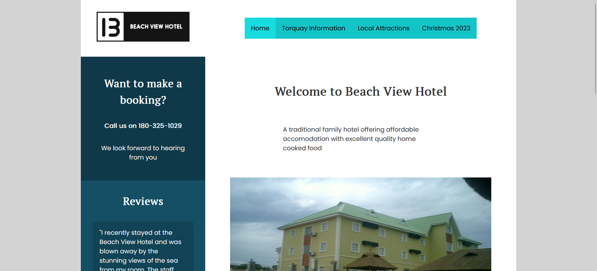

# Beach View Hotel

## Old website

## Improved website

[View Live](https://beachview.flynnp4yne.com/)

Beach View Hotel is a website created for an assignment at Ara Institute of Canterbury. The main goals of this project were to improve on an existing website and make it more user friendly using User Experience principles. I had to identify five issues on four different pages, then state why it is an issue and how to fix it. I then had to recreate the website in HTML and CSS from scratch.

## Grades
I got a grade of 100% for this project and an A- overall for the class.

## Languages
+ HTML and CSS
+ JavaScript

## License

[MIT](https://choosealicense.com/licenses/mit/)